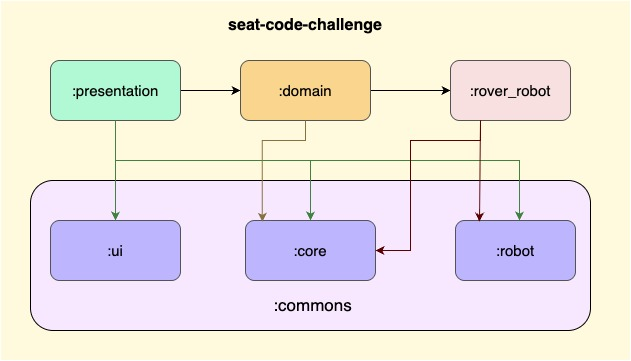

# 📱 Android Technical Challenge – Jetpack Compose + Clean Architecture (MVI)

This project is a technical challenge built using **Kotlin** and **Jetpack Compose**, structured following **Clean Architecture** principles and the **MVI (Model–View–Intent)** presentation pattern.

---

## 📝 Code Challenge Version

- **Version:** 1
- **Updated at:** May 8, 2025
- **Context:** SEAT CODE Android coding challenge


## 🧠 Architecture

The codebase is divided into modular layers following Clean Architecture:

- **app** – Entry point and dependency graph.
- **presentation** – UI layer with Jetpack Compose and ViewModels.
- **domain** – Business logic and use cases.
- **rover-robot** – Feature module for robot logic.
- **commons:core** – Shared core utilities (e.g., constants, error models).
- **commons:ui** – Shared Compose UI components.
- **commons:robot** – Robot-specific shared logic or UI elements.



### 📁 Project structure

```text
📦seat-code-challenge
┣ 📂app
┣ 📂domain
┣ 📂presentation
┣ 📂data
┣ 📂commons
┃ ┣ 📂core
┃ ┗ 📂ui
┃ ┗ 📂robot
┗ 📜README.md
```

## ⚙️ Presentation Pattern – MVI

The project uses **MVI (Model–View–Intent)** to manage UI state and user interactions in a unidirectional data flow:

1. **Intent** – User actions sent from the UI.
2. **ViewModel** – Receives intents and emits **ViewState** and **Effects**.
3. **View** – Renders the current state and responds to effects.

### ✅ Benefits

- Predictable state management
- Clear separation of concerns
- Scalable to complex UIs

---

## 🛠️ Tech Stack & Libraries

| Purpose              | Libraries Used                                      |
|----------------------|-----------------------------------------------------|
| UI                   | Jetpack Compose, Material3                          |
| Dependency Injection | Dagger Hilt                                         |
| State Management     | Kotlin Coroutines, StateFlow                        |
| JSON Parsing         | Moshi                                               |
| Testing              | JUnit4, Espresso, Compose UI Test, Shot             |
| Navigation           | Jetpack Navigation Compose                          |
| Build                | Gradle (KTS), Kotlin 2.x support                    |

---

## 🔄 GitHub Actions CI

The project integrates a set of GitHub Actions workflows to automate builds and testing:

| Workflow                     | Description                                                               |
|------------------------------|---------------------------------------------------------------------------|
| **Generate debug APK**       | Builds the application in `debug` mode and outputs an installable `.apk`. |
| **Run tests**                | Executes unit tests, UI tests and Screenshot tests using Gradle.          |
| **Version catalog update**   | Checks and updates dependencies defined in `libs.versions.toml`.          |
| **Update screenshots baseline** | Automatically commits new screenshot baselines after test execution.      |

> All workflows are configured to be triggered manually except "Run Tests" that are configured to run on received pull requests also.

---

## 🧪 Testing

The project includes:

- ✅ **Unit Tests** – For use cases and ViewModels.
- 📸 **UI Screenshot Tests** – Powered by [Shot](https://github.com/pedrovgs/Shot).
- 🧪 **Instrumentation Tests** – With Espresso and Compose Test APIs.

### Run screenshot tests

```bash
./gradlew executeScreenshotTests
```

## 🚀 Getting Started

### 🧾 Requirements

- Android Studio **Giraffe** or newer
- Kotlin **2.x**
- Minimum SDK: **API 26**

### Clone the repository

```bash
git clone https://github.com/dhonti/seat-code-challenge.git
```

## 📄 Additional Notes

- The project uses **Kotlin 2.x** along with the **Jetpack Compose Compiler plugin** as required for Compose development.
- All CI workflows are defined using **GitHub Actions**, including debug APK generation, testing, screenshot baselines, and version catalog automation.
- **Gradle Configuration Cache** and **Build Caching** are enabled to improve build performance.

